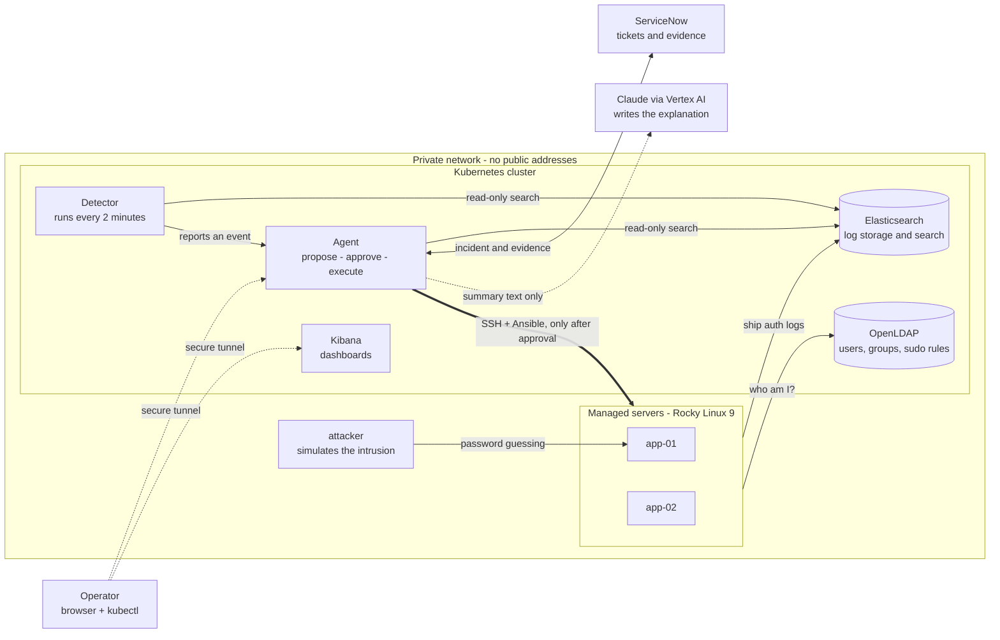

# Architecture

This document explains how OpsWarden is put together and, more importantly, *why*. If some of the
terminology is unfamiliar, there is a glossary at the bottom.

---

## The shape of it

Everything runs inside one private network in Google Cloud. Nothing is published to the internet.

---

## Following one incident through the system

**1. Logs are collected.** Each Linux server runs Elastic Agent, a small program that reads the
system's authentication log (every login, every `sudo`) and forwards it to Elasticsearch. That
gives one searchable place for all servers' security events.

**2. The detector looks for a pattern.** A scheduled job wakes every two minutes and asks
Elasticsearch a question: *in the last ten minutes, has any single source address produced a lot of
failed logins?* If so, it asks a second question: *has the targeted account ever logged in
successfully?* A burst of failures against an account nobody uses is far more suspicious than a
few failures against an active one. When both are true, it reports an event.

**3. The agent decides what** ***could*** **be done.** A plain, deterministic policy maps the event
type to specific actions. A brute force against an account produces exactly two: lock that account,
and block that address. The policy has no intelligence and no discretion, which is the point.

**4. Those actions are checked against an allowlist.** Each action names one of a few pre-written
Ansible playbooks and passes a fixed set of parameters. Anything outside that list is rejected
immediately, before a human ever sees it.

**5. The language model writes the prose.** Claude receives the event and the already-chosen
actions and writes a summary and a risk assessment. It cannot add, remove, or alter actions. If it
is unavailable or returns something malformed, a generated summary is used instead and the flow
continues.

**6. A ticket is opened and the flow pauses.** A real ServiceNow incident is created carrying the
summary and the log excerpt. The workflow then **pauses**, and the pause is written to disk. If the
agent crashes or is redeployed, the pending approval survives.

**7. A human decides.** The operator signs in against the directory. Only members of the
administrators group see the Approve and Reject buttons. Their verified username is what the audit
trail records.

**8. The approved actions run.** The agent runs Ansible from inside the cluster, connecting to the
servers over the private network. Execution happens in the background, because a full patch run can
take twenty minutes and should not hold an HTTP request open.

**9. It proves the outcome.** Afterwards it re-checks the result: can the account still
authenticate, is the address actually blocked, have the failed logins stopped. That evidence, plus
the raw command output, is written to the ticket, which is then resolved.

---

## Where trust boundaries sit

This is the security design in one list.

| Boundary | The rule |
|---|---|
| **Model to actions** | The model never selects an action. A deterministic policy does, and an allowlist validates it |
| **Agent to logs** | Read-only credential. Investigation cannot modify data |
| **Log text to model** | Log lines are attacker-influenced, so they are labelled as data, capped, and never treated as instructions |
| **Model output** | Validated against a strict schema; malformed or refused output falls back to a generated summary |
| **Human to approval** | Verified directory login, plus group membership. Not a name typed into a form |
| **Machine to intake** | The detector holds a token that permits reporting events and nothing else |
| **Agent to servers** | A dedicated SSH key held in Secret Manager, for a single purpose-built account |
| **Cluster to internet** | No inbound access. Servers have no public addresses and reach out through a NAT gateway |

---

## Decisions worth explaining

**Real virtual machines, not containers, as the managed servers.**
Patching a container proves nothing, because you would normally rebuild the image instead. Patching
a real Linux server, checking the services still run, and comparing before and after is the actual
job this automates.

**Standard Kubernetes rather than the fully-managed Autopilot mode.**
Elasticsearch needs a privileged startup step to raise a kernel limit, and log shipping needs an
agent on every node. Autopilot restricts both.

**No public addresses on any server.**
Administrative access goes through Identity-Aware Proxy, Google's authenticated tunnel. Outbound
traffic for package updates goes through a NAT gateway. There is no open SSH port anywhere.

**A static list of servers for the in-cluster automation.**
The dynamic cloud inventory plugin was unreliable from inside the cluster: an occasional API
failure was silently swallowed, leaving Ansible with an empty host list. Two servers with fixed
private addresses do not need discovery.

**Our own detection rules instead of the vendor's machine learning.**
Elastic's anomaly detection is a paid feature. A short, readable Python rule is free, easier to
explain, and easier to tune.

**The approval pause is stored on disk, not held in memory.**
An approval might arrive hours later. Keeping the paused workflow in a database means a restart
does not lose it.

**Passwords are set by the directory server, not hashed by the automation.**
The automation asks the directory to set a password rather than computing a hash itself. Fewer
places handling credentials, and no dependency on a hashing tool being installed.

---

## Glossary

- **Kubernetes** — software that runs and restarts containers across a group of machines. **GKE**
  is Google's managed version.
- **Container** — a packaged application with everything it needs to run.
- **LDAP** — a directory of users and groups. The single source of truth for who exists.
- **SSSD** — the Linux service that asks LDAP "does this user exist, and may they log in?"
- **sudo** — the Linux mechanism for running a command as an administrator.
- **Elasticsearch** — a search engine, used here to store and query log lines. **Kibana** is its
  dashboard.
- **Ansible** — a tool that connects to servers over SSH and applies a defined list of tasks. A
  **playbook** is one such list.
- **Terraform** — describes cloud infrastructure as text files so it can be rebuilt identically.
- **Workload Identity** — lets a program running in Kubernetes prove who it is to Google Cloud
  without storing a key file.
- **Identity-Aware Proxy (IAP)** — an authenticated tunnel for reaching machines that have no
  public address.
- **NAT gateway** — lets machines without public addresses make outbound connections.
- **CronJob** — a scheduled, repeating task in Kubernetes.
